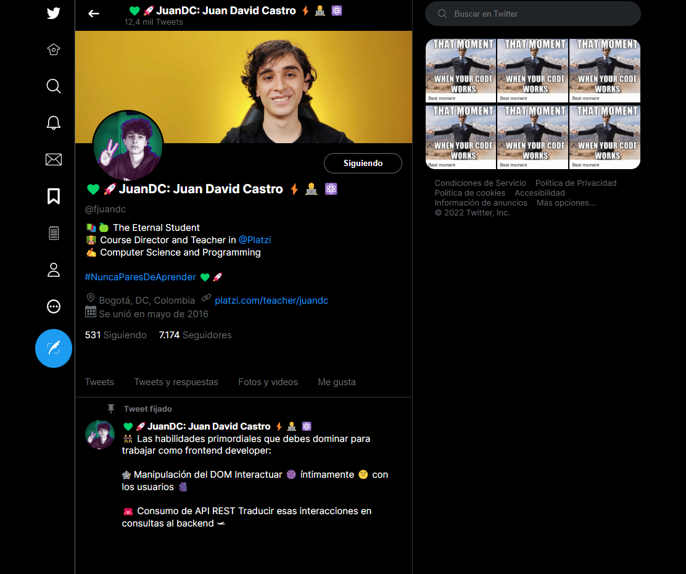

# Profile-Twitter-Account-JuanDC.

<figure style="text-align:center">

<figcaption>Profile Page Desktop version - 1980px</figcaption>
</figure>

## About of the project

This project is the second web page built of the second version of <a href="https://platzi.com/retos/portafolio-web-v2/">#PlatziChallenge</a> of <a href="https://platzi.com">Platzi</a>.

This project is a web page static and consist on make a clone of the JuanDC's twitter account profile using HTML5 and CSS3.

## Responsive Design

One of the aims is build this project with best practice, thus we use the methology "Mobile First" to make the page.

The images show the mobile and tablet version of the Instagram's Home Page.

<figure style="text-align:center">

<figcaption>Profile Page Desktop version - 1024px</figcaption>
 

<figcaption>Profile Page Tablet version - 768px</figcaption>
 

<figcaption>Profile Page Mobile version - 320px</figcaption>
</figure>
